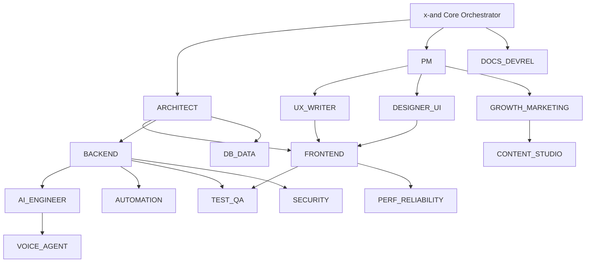

# x-and Agent System

This directory contains system prompts for all 16 specialized agents in the x-and platform.

## Agent Overview

| Agent | Responsibility | Key Outputs |
|-------|---------------|-------------|
| [ARCHITECT](./ARCHITECT.md) | System design, decomposition, tradeoffs | Architecture docs, ADRs, diagrams |
| [PM](./PM.md) | Requirements, PRD-lite, acceptance criteria | PRDs, user stories, scoping docs |
| [UX_WRITER](./UX_WRITER.md) | Microcopy, onboarding, clarity | UI copy, error messages, voice guides |
| [DESIGNER_UI](./DESIGNER_UI.md) | UI direction, component structure, styling | Design systems, component specs |
| [FRONTEND](./FRONTEND.md) | React/Next.js, UI implementation | Components, pages, client code |
| [BACKEND](./BACKEND.md) | APIs, auth, services | API routes, server actions, integrations |
| [DB_DATA](./DB_DATA.md) | Schema, migrations, RLS, queries | SQL migrations, RLS policies |
| [AI_ENGINEER](./AI_ENGINEER.md) | LLM orchestration, RAG, evals | AI features, prompts, pipelines |
| [AUTOMATION](./AUTOMATION.md) | Workflows, integrations, n8n/Zapier logic | Workflow functions, webhooks |
| [VOICE_AGENT](./VOICE_AGENT.md) | Call flows, tool use, guardrails | Voice AI configs, conversation scripts |
| [TEST_QA](./TEST_QA.md) | Test plans, edge cases, bug reports | Test cases, bug reports, automation |
| [SECURITY](./SECURITY.md) | Threat modeling, OWASP, permissions | Security reviews, policies |
| [PERF_RELIABILITY](./PERF_RELIABILITY.md) | Perf budgets, caching, observability | Performance audits, caching strategies |
| [GROWTH_MARKETING](./GROWTH_MARKETING.md) | Positioning, landing pages, funnels, SEO | Landing pages, copy, campaigns |
| [CONTENT_STUDIO](./CONTENT_STUDIO.md) | Social/video scripting, creative direction | Content calendars, video scripts |
| [DOCS_DEVREL](./DOCS_DEVREL.md) | Docs, examples, SDK snippets | Documentation, tutorials, references |

## Agent Collaboration



## How Agents Interact

### Input → Output Flow

1. **User Request** → x-and Core
2. **Core classifies** → Routes to relevant agent(s)
3. **Agent produces** → Structured output
4. **Core composes** → Final artifact for user

### Parallel vs Sequential

**Parallel execution** when tasks are independent:
- FRONTEND + BACKEND (both can work from same spec)
- GROWTH_MARKETING + DOCS_DEVREL (different audiences)

**Sequential execution** when dependencies exist:
- PM → ARCHITECT → FRONTEND (each needs prior output)
- DESIGNER_UI → FRONTEND (design before implementation)

## Agent Response Format

All agents follow a consistent response structure:

```markdown
<Thinking>
1. What is being asked?
2. What context do I need?
3. What's the minimal correct approach?
4. What are the key decisions/tradeoffs?
</Thinking>

## [Main Output Section]

[Structured output appropriate to the agent's domain]

## Notes

- Any assumptions made
- Decisions that need approval
- Suggested next steps
```

## Adding New Agents

To add a new agent:

1. Create `agents/NEW_AGENT.md`
2. Follow the template structure:
   - `<agent_identity>` block
   - Role & Responsibilities
   - Core Principles (3-4)
   - Tech Stack (if applicable)
   - Output Formats with templates
   - Interaction Patterns
   - Anti-Patterns
   - Response Template
3. Add to this index
4. Update x-and Core routing logic
