# x-and System Architecture

## High-Level Flow

```mermaid
flowchart TD
    subgraph Input["📥 User Input"]
        REQ[User Request]
    end

    subgraph Core["🧠 x-and Core Orchestrator"]
        CLASSIFY[Classify Intent]
        ROUTE[Route to Agents]
        COMPOSE[Compose Output]
    end

    subgraph Modes["🎯 Intent Modes"]
        DISCUSS[DISCUSS/PLAN]
        BUILD[BUILD/EDIT]
        DEBUG[DEBUG]
        RESEARCH[RESEARCH]
        GROWTH[GROWTH]
    end

    subgraph Agents["🤖 Specialized Agents"]
        subgraph Strategy["Strategy"]
            PM[PM]
            ARCH[ARCHITECT]
        end
        subgraph Design["Design"]
            UI[DESIGNER_UI]
            UX[UX_WRITER]
        end
        subgraph Engineering["Engineering"]
            FE[FRONTEND]
            BE[BACKEND]
            DB[DB_DATA]
            AI[AI_ENGINEER]
        end
        subgraph Automation["Automation"]
            AUTO[AUTOMATION]
            VOICE[VOICE_AGENT]
        end
        subgraph Quality["Quality"]
            TEST[TEST_QA]
            SEC[SECURITY]
            PERF[PERF_RELIABILITY]
        end
        subgraph Content["Content"]
            MKT[GROWTH_MARKETING]
            CONT[CONTENT_STUDIO]
            DOCS[DOCS_DEVREL]
        end
    end

    subgraph Output["📤 Output"]
        ARTIFACT[xandArtifact]
    end

    REQ --> CLASSIFY
    CLASSIFY --> DISCUSS
    CLASSIFY --> BUILD
    CLASSIFY --> DEBUG
    CLASSIFY --> RESEARCH
    CLASSIFY --> GROWTH

    DISCUSS --> ROUTE
    BUILD --> ROUTE
    DEBUG --> ROUTE
    RESEARCH --> ROUTE
    GROWTH --> ROUTE

    ROUTE --> Strategy
    ROUTE --> Design
    ROUTE --> Engineering
    ROUTE --> Automation
    ROUTE --> Quality
    ROUTE --> Content

    Strategy --> COMPOSE
    Design --> COMPOSE
    Engineering --> COMPOSE
    Automation --> COMPOSE
    Quality --> COMPOSE
    Content --> COMPOSE

    COMPOSE --> ARTIFACT
```

---

## Agent Dependencies Flow

---

## Request Processing Pipeline

---

## Build Request Example Flow

---

## Agent Communication Pattern

---

## Three Pillars Integration

```mermaid
flowchart LR
    subgraph BUILD["🔨 BUILD"]
        B1[Web Apps]
        B2[Mobile Apps]
        B3[AI Tools]
        B4[Internal Tools]
    end

    subgraph BRAND["🎨 BRAND"]
        BR1[Visual Identity]
        BR2[Messaging]
        BR3[Website]
        BR4[Social Content]
    end

    subgraph RUN["⚙️ RUN"]
        R1[Automations]
        R2[CRM]
        R3[Voice Agents]
        R4[Analytics]
    end

    BUILD <-->|"Connected"| BRAND
    BRAND <-->|"Connected"| RUN
    RUN <-->|"Connected"| BUILD

    style BUILD fill:#e3f2fd
    style BRAND fill:#fce4ec
    style RUN fill:#e8f5e9
```

---

## File: x-and-architecture.md
